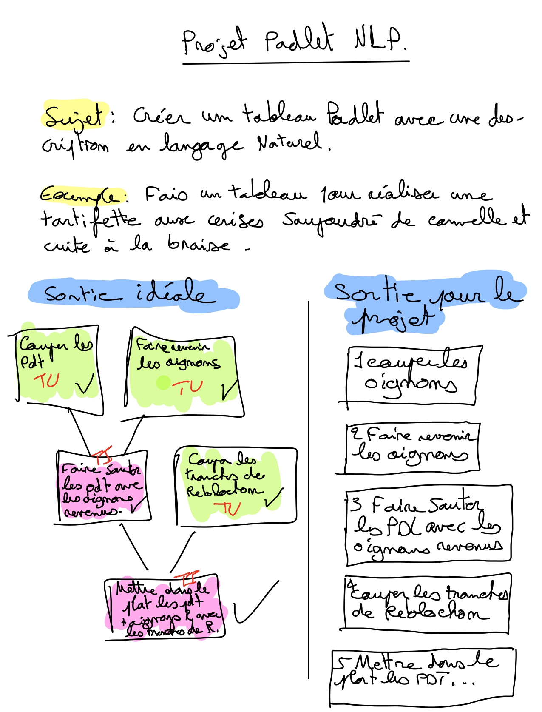

# Cahier des charges

## Objectif

L'objectif de ce projet est de créer un script Python qui permet de :

1. Récupérer le souhait de l'utilisateur sous forme de texte.
2. Envoyer la requête de l'utilisateur à ChatGPT Azure pour obtenir une réponse.
3. Enregistrer la requête de l'utilisateur et la réponse de ChatGPT Azure dans un fichier journal au format JSON.
4. Envoyer la réponse de ChatGPT Azure dans une section Padlet spécifique.

## Contraintes

- La saisie de l'utilisateur doit contenir au moins 10 caractères et ne doit pas contenir plus de 50% de chiffres ou de ponctuations.
- La réponse de ChatGPT Azure doit être au format JSON et doit contenir les clés "étape", "titre" et "description".
- Le fichier journal doit contenir l'horodatage de la requête et de la réponse, ainsi qu'un identifiant unique pour chaque entrée.
- L'envoi de la réponse dans Padlet doit se faire via l'API de Padlet en utilisant une clé API valide.

## Fonctionnalités

### Récupérer le souhait de l'utilisateur

La fonction `saisi_input()` permet de récupérer le souhait de l'utilisateur sous forme de texte en vérifiant que la saisie est valide.

### Envoyer la requête à ChatGPT Azure

La fonction `requete_gtp(recette)` permet d'envoyer la requête de l'utilisateur à ChatGPT Azure en utilisant l'API Azure OpenAI et de renvoyer la réponse au format JSON.

### Enregistrer la requête et la réponse dans un fichier journal

La fonction `save_to_log_json(requete_gpt_user, requete_user)` permet d'enregistrer la requête de l'utilisateur et la réponse de ChatGPT Azure dans un fichier journal au format JSON avec un horodatage et un identifiant unique pour chaque entrée.

### Envoyer la réponse dans Padlet

La fonction `api_padlet(Padlet_ID, API_KEY, Tab_ID, titre, contenu, url)` permet d'envoyer la réponse de ChatGPT Azure dans une section Padlet spécifique en utilisant l'API de Padlet et une clé API valide.

## Diagramme



## Exemple d'utilisation

```python
# Récupérer le souhait de l'utilisateur
requete_user = saisi_input()

# Envoyer la requête à ChatGPT Azure
requete_gpt_user = requete_gtp(requete_user)

# Enregistrer la requête et la réponse dans un fichier journal
save_to_log_json(requete_gpt_user, requete_user)

# Envoyer la réponse dans Padlet
Padlet_ID = "v96n8l3kxjayrndm"
API_KEY = ""
Tab_ID = "sec_mVbpvYpBKPjLqRkn"
url = "https://api.padlet.dev/v1/boards/"+Padlet_ID+"/posts"

for x in requete_gpt_user:
    titre = x + " : " + requete_gpt_user[x]["titre"]
    contenu = requete_gpt_user[x]["description"]
    api_padlet(Padlet_ID, API_KEY, Tab_ID, titre, contenu, url)
```