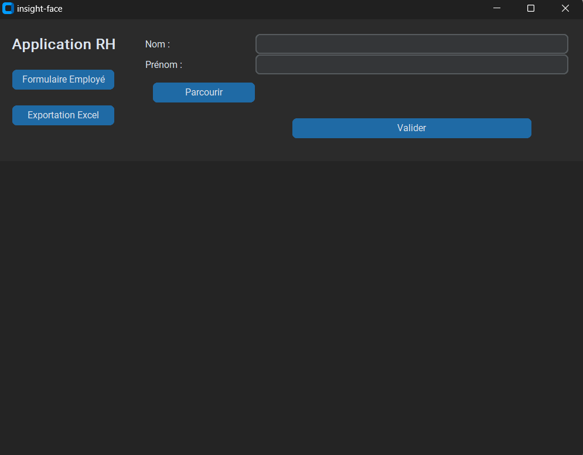

# Pointage Automatique des Employés par Reconnaissance Faciale
==========================================================

## Description
-----------

Ce projet est un système de pointage automatique des employés utilisant la reconnaissance faciale. Il offre une solution pratique et efficace pour enregistrer les heures d'arrivée et de départ des employés, en remplaçant les méthodes traditionnelles de pointage manuel. Le système comprend une application qui permet au service RH d'enregistrer de nouveaux employés et d'exporter les données d'un employé selon une plage de dates sous format Excel ou CSV. Le système prévoit également un monitoring pour détecter les éventuels dysfonctionnements.

# Fonctionnalités
---------------

### Reconnaissance Faciale

Le système utilise un modèle de reconnaissance faciale pré-entraîné pour détecter et identifier les employés. Lorsqu'un employé se présente devant la caméra, le système capture son visage et le compare aux visages enregistrés dans la base de données. Si une correspondance est trouvée, le système enregistre l'heure de passage de l'employé.

### Enregistrement des Employés

L'application permet au service RH d'enregistrer de nouveaux employés en fournissant une vidéo de 15 secondes environ de leur visage. L'application traite la vidéo, détecte le visage de l'employé, découpe les zones d'intérêt et labelise les fichiers avec le nom et le prénom de l'employé. Les fichiers sont ensuite stockés dans la base de données pour être utilisés lors de la reconnaissance faciale.

### Exportation des Données

Le service RH peut exporter les données d'un employé selon une plage de dates spécifique sous format Excel ou CSV. Cette fonctionnalité permet de générer facilement des rapports et de suivre les heures de travail des employés.

### Monitoring

Le système prévoit un monitoring pour détecter les éventuels dysfonctionnements, tels que les employés non reconnus ou les erreurs d'enregistrement. Le développeur peut accéder à la base de données pour consulter les logs de l'application et remonter jusqu'à la source du problème.

Phase de Test (POC)
-------------------

Pour la phase de test (POC), le développement se fait sur un environnement local avec une webcam filaire et une VM locale. Il n'y a pas d'interface utilisateur physique pour l'employé et un traitement limité des cas particuliers. Le système affiche les résultats de la reconnaissance faciale dans le terminal pour vérifier son bon fonctionnement.

