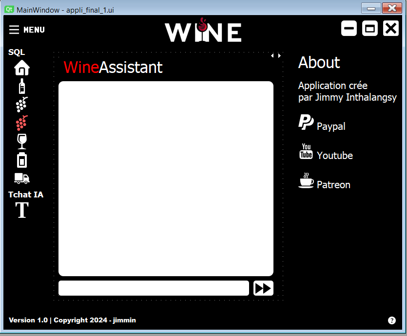

# Projet de Système de Gestion de Coopérative Vinicole

Ce projet vise à développer un système de gestion complet pour une coopérative vinicole, comprenant un système de base de données robuste et une application de bureau intuitive avec interaction en langage naturel.

## Fonctionnalités

- Système de Base de Données (BDD) : Un système de base de données sécurisé, performant et scalable pour stocker toutes les informations relatives à la coopérative, incluant les détails sur les vins, les cuves, les cépages, les appels d'offre, et les tournées de collecte.

- Application de Bureau : Une application de bureau intuitive permettant aux utilisateurs d'interagir avec la base de données via des requêtes en langage naturel. L'application facilitera les tâches quotidiennes de l’œnologue et des techniciens, optimisant ainsi les processus de collecte et d'assemblage des vins.

- Chaîne d'Intégration Continue (CI) et de Déploiement Continu (CD) : Une approche CI/CD pour assurer des mises à jour régulières et la maintenance de l'application.

- Utilisation de Docker : Docker est utilisé pour isoler les environnements, simplifier le déploiement, assurer la scalabilité et gérer les dépendances.

## État du Projet

Le projet est toujours en cours de développement.
Actuellement, les composantes suivantes ont été mises en place :

- Installation d'Ollama et Mistral en local.
- Mise en place de la base de données MySQL.
- Développement de l'interface utilisateur

